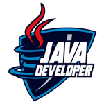

# Dio Trilha Java Basico
|  |  |
|:---:|:---:|
| *Participei da Formação Java Developer da DIO, onde aprendi desde os fundamentos de Java até o uso avançado do Spring Framework. A imersão inicial abrangeu os princípios da linguagem e a Programação Orientada a Objetos. * | Nos módulos seguintes, aprofundei meu conhecimento e desenvolvi habilidades para projetos robustos. A formação incluiu desafios de código e projetos práticos para aplicar o aprendizado.|

## Tecnologias

  

## Índice

- [Instrutores](#instrutor)
- [Apresentação](#apresentacao)
- [Fundamentos da Plataforma Java](#fundamentos-da-plataforma-java)
    - [Introdução à Plataforma Java](#introdução-à-plataforma-java)
    - [Ambiente de Desenvolvimento Java](#ambiente-de-desenvolvimento-java)
    - [Aprendendo a Sintaxe Java](#aprendendo-a-sintaxe-java)
        - [Anatomia das Classes](#anatomia-das-classes)
        - [Tipos e Variáveis](#tipos-e-variáveis)
        - [Operadores](#operadores)
        - [Métodos](#métodos)
        - [Escopo de Variáveis](#escopo-de-variáveis)
        - [Palavras reservadas](#palavras-reservadas)
        - [Java Documentação](#java-documentação)
        - [Terminal e Argumentos](#terminal-e-argumentos)        
- [Considerações Finais](#considerações-finais)
- [Certificados](#certificados)
- [Licença](#licença)

## <a name="instrutor"> Instrutores </a>

- [Gleyson Sampaio](https://github.com/glysns) - Desenvolvedor de Software e Instrutor Dio: Apaixonado por programação, nômade digital. Gosto de games, séries, viajar, trilhas, bike, vinhos, arriscar na cozinha e detonar no GOW e SC2

## <a name="apresentacao"> Apresentação </a>

O curso "Fundamentos da Plataforma Java" me proporcionou uma imersão abrangente no universo da programação Java, desde conceitos básicos até aspectos mais avançados da linguagem. Ao longo do curso, explorei a sintaxe de Java, compreendi a importância do ambiente de desenvolvimento e dominei tópicos essenciais como tipos e variáveis, operadores, métodos e escopo de variáveis. Além disso, aprendi sobre palavras reservadas, documentação em Java e interação com programas via terminal, expandindo minhas habilidades e preparando-me para desenvolver aplicativos Java robustos e eficientes.

Com uma base sólida estabelecida durante o curso, estou agora equipado para continuar explorando os vastos recursos da linguagem Java e aplicá-los em projetos futuros. Seja desenvolvendo aplicativos corporativos, construindo soluções para dispositivos móveis ou contribuindo para o desenvolvimento de software multiplataforma, o conhecimento adquirido neste curso servirá como alicerce para minha jornada como desenvolvedor Java. Aguardo ansiosamente para ver minhas realizações e meu progresso contínuo em minha carreira na programação Java.

## <a name="fundamentos-da-plataforma-java"> Fundamentos da Plataforma Java </a>

### <a name="introdução-à-plataforma-java"> Introdução à Plataforma Java </a>  

- [x] [Introdução à Plataforma Java]

Após concluir o curso de Java Básico, estou apto a explicar as principais características e funcionalidades desta linguagem de programação.

Primeiramente, Java é reconhecido por sua simplicidade e facilidade de compreensão. Este aspecto foi deliberadamente planejado pelos desenvolvedores da Javasoft para atender às demandas de dispositivos eletrônicos com recursos limitados.

Além disso, Java é uma linguagem orientada a objetos, o que significa que tudo em Java é definido em termos de classes e objetos. Isso implica na compreensão dos pilares da Programação Orientada a Objetos, que incluem classe e objeto, encapsulamento, abstração, herança e polimorfismo.

Um dos pontos fortes do Java é sua portabilidade, possibilitada pelo conceito WORA (Write Once Run Anywhere). Isso significa que o código Java pode ser compilado para bytecode, independente da plataforma, garantindo que o mesmo código funcione em diferentes sistemas operacionais.

Além da portabilidade, a linguagem Java é robusta e segura. Ela lida eficientemente com encerramentos inesperados de programas, possui um gerenciamento de memória forte, coleta de lixo automática, tratamento de exceções e mecanismos de verificação de tipo. Também oferece recursos de segurança, como criptografia, para proteger os dados contra ameaças como vírus e adulteração.

Outra característica importante é que o Java é interpretado pela JVM (Java Virtual Machine). Os programas Java são compilados para bytecode, que é interpretado pela JVM durante a execução, tornando-os independentes do sistema operacional.

Além disso, o Java oferece suporte a multi-threading, permitindo a execução de vários threads simultaneamente, o que é essencial para processos paralelos.

Quanto à história do Java, ele foi desenvolvido pela Sun Microsystems no início dos anos 90. Inicialmente chamado de Oak, foi renomeado para Java devido à sua versatilidade e potencial para desenvolvimento web dinâmico. Desde então, Java se tornou uma das linguagens de programação mais populares e é amplamente utilizado em uma variedade de aplicações, desde páginas da web interativas até aplicativos corporativos e software para dispositivos móveis.

Em relação às versões do Java, cada uma trouxe novas funcionalidades e melhorias. Desde o lançamento da JDK 1.0 em 1996 até a versão mais recente, o Java SE 17 LTS, lançado em setembro de 2021, o Java continua evoluindo para atender às demandas em constante mudança da indústria de desenvolvimento de software.

Por fim, o processo de desenvolvimento em Java envolve a escrita de código-fonte em arquivos .java, que são compilados para bytecode (.class) pelo compilador javac. Esse bytecode é então interpretado pela JVM durante a execução do programa.

Em resumo, Java é uma linguagem de programação poderosa, versátil e amplamente adotada, com uma longa história de evolução e inovação contínua. A compreensão de seus conceitos e recursos é essencial para qualquer desenvolvedor que deseje entrar no mundo da programação orientada a objetos e desenvolvimento de software multiplataforma.

### <a name="ambiente-de-desenvolvimento-java"> Ambiente de Desenvolvimento Java </a>

- [x] [Ambiente de Desenvolvimento Java]

Depois de concluir o curso de Java Básico, agora posso explicar como configurar o ambiente de desenvolvimento para começar a programar em Java.

O primeiro passo é garantir que o JDK (Java Development Kit) esteja instalado no nosso sistema. Isso é essencial para podermos compilar e executar programas Java. Ao instalar o JDK, é importante verificar se estamos utilizando a versão correta de acordo com os requisitos do projeto.

No Windows, podemos baixar e instalar o JDK facilmente, e algumas IDEs como o Visual Studio Code já são capazes de fazer isso automaticamente. Basta procurar pelo JDK desejado no site da Oracle, realizar o download do instalador e executá-lo. Durante a instalação, tanto o JDK quanto a JRE (Java Runtime Environment) serão instalados no sistema.

É importante evitar alterar o diretório de instalação durante esse processo. Após a instalação, podemos verificar se as variáveis de ambiente foram configuradas corretamente para podermos executar o Java pelo Prompt de comando ou PowerShell do Windows, digitando o comando java -version.

No entanto, não é necessário configurar as variáveis de ambiente manualmente, já que vamos utilizar IDEs poderosas que aumentam nossa produtividade ao codificar em Java. Essas IDEs oferecem recursos como auto-completar, formatação de código, análise de erros de sintaxe, compilação e depuração de programas.

Existem diversas opções de IDEs disponíveis, como Eclipse, IntelliJ e Visual Studio Code. Cada uma tem seus pontos fortes e recursos específicos, então é importante fazer uma pesquisa e experimentar cada uma delas antes de escolher a que melhor se adequa às nossas necessidades.

O Eclipse, por exemplo, é muito utilizado em ambientes corporativos e oferece uma interface interativa e plugins adicionais, como o WindowBuilder para desenvolvimento de interfaces gráficas. O IntelliJ, por sua vez, é conhecido por sua inteligência e oferece sugestões assertivas durante o desenvolvimento. Já o Visual Studio Code, desenvolvido pela Microsoft, é um editor de texto simples e interativo, com ótimo desempenho e integração com outras tecnologias.

Depois de escolher a IDE, podemos começar a explorar seus recursos e colocar a mão na massa. Podemos aprender a criar ou abrir projetos Java, configurar a JDK na IDE, importar projetos Maven, conhecer os principais atalhos e executar ou depurar nossos programas.

Além disso, é importante entender o que são workspaces, definir a JDK na IDE e conhecer os atalhos disponíveis, que facilitam o desenvolvimento. E não podemos esquecer do Maven, uma ferramenta de automação de compilação amplamente utilizada em projetos Java.

Resumindo, configurar o ambiente de desenvolvimento para Java envolve instalar o JDK, escolher a IDE adequada e explorar seus recursos para aumentar nossa produtividade ao programar em Java.

### <a name="aprendendo-a-sintaxe-java"> Aprendendo a Sintaxe Java </a>

- [x] [Aprendendo a Sintaxe Java]

Olá pessoal! Sejam todos bem-vindos ao nosso curso sobre Java básico! Aqui, compartilharei minha experiência e as práticas que aprendi ao longo do curso.

Na segunda etapa deste curso, mergulhamos na sintaxe da linguagem Java, explorando as regras essenciais para escrever códigos de forma eficiente e compreender os pré-requisitos necessários, como a instalação do JDK e a escolha de uma IDE.

### <a name="anatomia-das-classes"> Anatomia das Classes </a>

Durante essa jornada, aprendi que a anatomia da classe é fundamental para compreender a estrutura inicial dos códigos. Aprendi como iniciar e encerrar instruções, a importância da identação e como organizar arquivos em pacotes para uma gestão de projetos mais eficiente.

Exploramos conceitos como declaração de variáveis e métodos, seguindo padrões de nomenclatura para tornar o código mais legível. A identação se mostrou uma aliada importante para uma organização clara do código. Além disso, aprendi sobre o uso de pacotes para uma melhor organização dos arquivos em nossos projetos, garantindo uma estrutura mais gerenciável à medida que o projeto cresce.

Java Beans foi outro conceito fundamental que aprendi. Ele traz clareza e objetividade às implementações, ajudando a desenvolver códigos mais eficientes e de fácil manutenção.

Durante o curso, tive a oportunidade de praticar a criação de projetos Java no VS Code, o que me permitiu aplicar os conceitos aprendidos de forma prática.

Agora compreendo a importância da declaração de variáveis e métodos em Java, seguindo padrões de nomenclatura para uma escrita mais clara e consistente. A indentação se mostrou crucial para a compreensão e visualização dos códigos, facilitando a manutenção futura.

Além disso, aprendi a utilizar pacotes para organizar meus projetos de forma hierárquica, refletindo a finalidade e identidade de cada um.

Java Beans, por sua vez, trouxe uma nova perspectiva sobre como estruturar meus códigos de forma mais coesa e compreensível, visando uma melhor colaboração em equipe e uma manutenção mais eficiente no futuro.

### <a name="tipos-e-variáveis"> Tipos e Variáveis </a>

Durante o Curso Didático de Java Básico, promovido pela Digital, mergulhei fundo no universo do Java, explorando tipos e variáveis com foco na codificação. Ao longo dessa jornada de aprendizado, adquiri habilidades fundamentais para o desenvolvimento em Java.

Primeiramente, aprendi sobre os tipos de dados em Java, desde os básicos como números inteiros e decimais até tipos lógicos e caracteres. Entendi a distinção crucial entre variáveis e constantes, compreendendo como declará-las e utilizá-las em meus programas.

Para colocar em prática o que aprendi, organizei meu ambiente de estudo seguindo as recomendações do curso. Criei um diretório "estudos" e sincronizei um repositório no GitHub, onde pude armazenar exemplos práticos e exercícios relacionados ao curso. Essa organização facilitou meu aprendizado e me permitiu compartilhar conhecimento com outros participantes.

Na parte prática do curso, explorei os tipos primitivos em Java, compreendendo suas capacidades e limitações. Aprendi a definir variáveis e constantes, seguindo as regras e convenções estabelecidas na linguagem. Além disso, entendi a importância de garantir a imutabilidade de certos valores utilizando a palavra reservada "final".

Ao longo das aulas, pude praticar exemplos e exercícios, recebendo dicas valiosas e esclarecendo dúvidas na comunidade online do curso. Aprendi não apenas a teoria, mas também a aplicabilidade prática dos conceitos aprendidos.

Agora, estou confiante em minha capacidade de desenvolver programas em Java, utilizando tipos e variáveis de forma eficiente e seguindo as melhores práticas da linguagem. Estou ansioso para continuar explorando temas mais avançados nos próximos cursos.

- Arquivo de teste [Aprendendo a Sintaxe Java](aprendendo-a-sintaxe/src/TiposVariaveis.java)

### <a name="peradores"> Operadores </a>

Logo no início do curso, aprendi sobre os operadores de atribuição, que são essenciais para definir e atualizar valores de variáveis. Descobri como usar o operador "=" para iniciar ou modificar o valor de uma variável, seja ela do tipo numérico ou de texto. Além disso, exploramos os operadores aritméticos, que são fundamentais para realizar cálculos matemáticos, como adição, subtração, multiplicação e divisão.

Em seguida, mergulhamos nos operadores unários, que são aplicados em conjunto com outros operadores aritméticos. Aprendi a utilizar o operador de incremento "++" e o de decremento "--" para alterar valores de variáveis de forma eficiente. Também descobri como usar o operador de negação "!" para inverter valores booleanos, o que é útil em muitas situações de programação.

Outro ponto interessante foi a exploração do operador ternário, uma ferramenta poderosa para simplificar expressões condicionais. Compreendi como usar esse operador para escolher entre dois valores com base em uma condição, tornando meu código mais conciso e legível.

Explorar os operadores relacionais foi uma parte crucial do curso. Aprendi a usar operadores como "==", "!=", ">" e "<=" para comparar valores e tomar decisões com base nessas comparações. Esses operadores foram fundamentais para construir expressões lógicas mais complexas e eficazes.

Por fim, mergulhamos nos operadores lógicos, que são essenciais para combinar várias condições e avaliar expressões booleanas. Descobri como usar os operadores "&&", "||" e "!" para criar condições mais complexas e tomar decisões em meus programas de forma eficiente.

Ao longo do curso, pude praticar e experimentar cada conceito aprendido, o que me ajudou a consolidar meu entendimento e me tornar mais confiante em usar operadores em meus próprios projetos de programação.

- Arquivo de teste [Operadores](aprendendo-a-sintaxe/src/Operadores.java)

### <a name="métodos"> Métodos </a>

No curso, aprendemos sobre a syntax de Java, com foco especial em métodos, dentro do contexto do Java básico. O objetivo principal era entender como criar métodos, discutir sobre parâmetros e visibilidade, o que é fundamental para a implementação eficaz de algoritmos.

Antes de mergulharmos nos conceitos, o instrutor destacou a importância de configurar adequadamente o ambiente de desenvolvimento, como o diretório do projeto, o Kit Hamp e uma IDE, para garantir alta produtividade durante as sessões.

Aprendi que ao criar métodos, é crucial entender suas propostas e finalidades. Devemos considerar o tipo de retorno esperado, os parâmetros necessários e a visibilidade do método. Esses critérios são essenciais para garantir que nossos métodos sejam eficientes e compreensíveis.

Durante o curso, também exploramos exemplos práticos para ilustrar esses conceitos. Por exemplo, criamos uma classe fictícia de Smart TV e implementamos métodos para ligar, desligar, mudar de canal e ajustar o volume. Foi muito gratificante ver esses conceitos aplicados em um projeto real.

Além disso, aprendi sobre a importância de seguir convenções de nomenclatura ao criar métodos. Seguir padrões como Camel Case torna o código mais legível e compreensível para todos os desenvolvedores.

No geral, o curso me proporcionou uma compreensão sólida dos métodos em Java e como aplicá-los em projetos do mundo real. Estou animado para continuar explorando e aprofundando meus conhecimentos em Java. 

Exercicios:

- Vamos criar um exemplo de uma classe para representar uma SmartTV onde:
    - Ela tenha as características: ligada (boolean), canal (int) e volume (int);
    - Nossa TV poderá ligar e desligar e assim mudar o estado ligada;
    - Nossa TV aumentará e diminuirá o volume sempre em +1 ou -1;
    - Nossa TV poderá mudar de canal de 1 em 1 ou definindo o número correspondente.

    - Arquivo do [Métodos SmartTv](metodo-sistema-smart-tv/src/SmartTv.java)
    - Arquivo do [Métodos Usuario](metodo-sistema-smart-tv/src/Usuario.java)

### <a name="escopo-de-variáveis"> Escopo de Variáveis </a>

Esse conceito define onde as variáveis podem ser acessadas em um programa Java, impactando diretamente na eficiência e estruturação de nossas implementações.

Aprendi que o escopo de uma variável está ligado ao bloco onde foi declarada. Isso significa que uma variável pode ser acessada apenas dentro do bloco em que foi definida.

Exploramos três tipos principais de escopo:

Escopo de Classe: Variáveis declaradas dentro de uma classe são acessíveis por todos os métodos dessa classe, sendo conhecidas como atributos da classe.

Escopo de Método: Variáveis declaradas dentro de um método estão limitadas ao corpo desse método e não podem ser acessadas por outros métodos fora dele.

Escopo de Bloco/Fluxo: Em contextos como loops e estruturas condicionais, as variáveis têm um escopo ainda mais restrito, limitado ao bloco em que são declaradas.

Durante o curso, percebi a importância de compreender onde declarar variáveis para evitar erros e criar algoritmos mais claros. Por exemplo, em uma classe de gerenciamento de contas, o saldo seria uma variável de escopo de classe, enquanto o valor a ser sacado em um método específico seria uma variável local desse método.

´´´java	
public class Conta {
	//variavel da classe conta
	double saldo=10.0;
	
	public void sacar(Double valor) {
		//variavel local de método
		double novoSaldo = saldo - valor;
	}
	public void imprimirSaldo(){
		//disponível em toda classe
		System.out.println(saldo);
		//somente o método sacar conhece esta variavel
		System.out.println(novoSaldo);
	
	}
	public double calcularDividaExponencial(){
		//variável local de método
		double valorParcela = 50.0;
		double valorMontante = 0.0; // começando a variável com valor zero
		for(int x=1; x<=5; x++) {//x variável de escopo de fluxo
			//esta variável será reiniciada a cada execução for
			double valorCalculado = valorParcela * x;
			valorMontante = valorMontante + valorCalculado;
		}
		//escopo de fluxo
		//x e valorCalculado nunca estarão disponíveis fora do for
		
		return valorMontante;
	}
}
´´´

Ao entender o escopo de variáveis, pude criar algoritmos mais eficientes e evitar falhas estruturais nos programas que desenvolvo. Estou empolgado para continuar explorando esse tema em exercícios e exemplos futuros, e espero poder compartilhar mais aprendizados em nossa jornada de aprendizado juntos.

### <a name="palavras-reservadas"> Palavras reservadas </a>

minha compreensão sobre as palavras reservadas da linguagem Java foi aprimorada significativamente. Agora consigo perceber a importância dessas palavras e sua real finalidade na programação.

Um dos pontos cruciais que aprendi é que as palavras reservadas são identificadores com funções específicas na linguagem e não podem ser utilizadas para nomear variáveis, classes, métodos ou atributos. Isso ficou claro quando exploramos exemplos como "int", que é uma palavra reservada para um tipo específico de variável.

Durante o curso, aprendi que a linguagem Java possui 52 palavras reservadas, todas escritas em minúsculas e organizadas em grupos. Essas palavras são fundamentais para o desenvolvimento em Java e são identificadas por cores especiais nas IDEs, o que facilita sua identificação durante o desenvolvimento.

Ao longo das aulas, exploramos as palavras reservadas agrupadas por finalidade, desde os controles de pacotes, como "import" e "package", até os tipos primitivos, como "boolean", "byte" e "char". Também discutimos os modificadores de acesso, como "public", "private" e "protected", e os modificadores de classe, variáveis e métodos, como "static", "final" e "abstract".

Outro aspecto importante que aprendi foi sobre a relação entre as palavras reservadas e conceitos como herança e manipulação de exceções. Palavras como "extends" e "implements" estão diretamente ligadas à herança, enquanto "throw" e "throws" são utilizadas para manipular exceções.

É interessante observar que algumas palavras reservadas são opostas umas às outras, o que significa que uma pode substituir a outra em determinados contextos. Essa compreensão me ajudou a aprofundar meu conhecimento sobre a linguagem Java e a escrever um código mais eficiente e legível.

Para consolidar meu aprendizado, pretendo praticar a classificação e o uso das palavras reservadas em exemplos reais e buscar referências adicionais para aprimorar meu conhecimento.

### <a name="java-documentação"> Java Documentação </a>

Aprendi a importância de adicionar comentários aos meus arquivos Java para melhorar a legibilidade e compreensão do código. Para isso, é essencial ter um diretório de projeto bem estruturado, integração com um kit de desenvolvimento Java e uma IDE configurada.

Durante o curso, explorei a documentação oficial da linguagem Java, compreendendo os diferentes tipos de documentos e explorando o Javadoc em detalhes. Uma dica valiosa foi utilizar as plataformas disponíveis, como fóruns e comunidades online, para interagir e esclarecer dúvidas sempre que necessário.

Percebi que a documentação em Java é uma das maiores vantagens dessa tecnologia. Ela fornece uma compreensão detalhada dos recursos da linguagem, permitindo explorar todas as funcionalidades de forma clara e intuitiva.

Aprendi que dominar a documentação oficial é essencial para se tornar um desenvolvedor avançado, pois não apenas ajuda a entender a linguagem, mas também a incorporar os melhores padrões nos projetos.

Seguindo o conselho do instrutor, mergulhei profundamente na documentação, descobrindo uma riqueza de funcionalidades prontas para serem utilizadas em meus projetos. A documentação detalha informações sobre métodos, construtores e atributos das classes, permitindo explorar todo o potencial da linguagem.

Além disso, aprendi a enriquecer minha documentação com tags relevantes, como autor, versão, parâmetros, tipos de retorno e exceções, para tornar a compreensão da classe e seus métodos ainda mais clara.

Um exemplo prático que explorei durante o curso foi a criação de documentação para a classe [Calculadora](aprendendo-a-sintaxe/src/Calculadora.java), destacando as tags mais utilizadas. Entendi que os comentários no código não devem compensar a falta de estruturação do algoritmo, mas sim complementá-lo, seguindo as boas práticas de programação.

Por fim, compreendi como o Javadoc é uma ferramenta poderosa para gerar documentação visual a partir do código-fonte, facilitando a compreensão e navegação do projeto.

- Terminal e Argumentos:
Explorando a Execução via Terminal. Durante esse curso, mergulhamos no fascinante mundo dos terminais e argumentos da aplicação Java, explorando maneiras simples de interagir com nossos programas sem depender de interfaces gráficas complexas.

Uma das partes mais interessantes foi aprender sobre os argumentos da classe principal e como passá-los para nossos programas Java. Isso abre possibilidades incríveis para tornar nossas aplicações mais dinâmicas e interativas. Por exemplo, aprendi a criar uma classe simples chamada "MinhaClasse" e executá-la diretamente do terminal, o que me permitiu compreender melhor como os arquivos compilados são armazenados e como executar programas Java de forma independente.

Além disso, exploramos a utilização da classe Scanner para capturar entrada de dados, o que tornou a interação com nossos programas muito mais amigável e intuitiva. Agora consigo solicitar informações aos usuários durante a execução do programa, tornando a experiência mais personalizada e fluida.

Um dos pontos altos do curso foi aprender a executar nossas aplicações passando parâmetros via linha de comando. Isso é especialmente útil quando nossos clientes ou usuários finais não têm a mesma IDE instalada, pois podemos distribuir nossos aplicativos sem depender de uma IDE específica.

No geral, este curso me proporcionou uma compreensão mais profunda de como interagir com programas Java através do terminal, ampliando minhas habilidades e tornando-me mais confiante na criação e execução de aplicativos Java. Mal posso esperar para explorar mais recursos da linguagem Java em meus projetos futuros!

## <a name="considerações-finais"> Considerações Finais </a>

Ao concluir este curso de Desenvolvedor Java, fornecido pela DIO (Digital Innovation One), uma jornada emocionante e repleta de aprendizado se encerra. Sob a orientação do talentoso instrutor Gleyson Sampaio, mergulhamos nas profundezas da linguagem Java, desde seus fundamentos até técnicas avançadas, capacitando-nos para enfrentar desafios no mundo do desenvolvimento de software.

A apresentação inicial do curso nos forneceu uma visão abrangente do que estava por vir. Desde os fundamentos da plataforma Java até a configuração do ambiente de desenvolvimento e a compreensão da sintaxe básica, cada etapa foi cuidadosamente planejada para nos levar em uma jornada de aprendizado eficaz.

Nos aprofundamos nos pilares da Programação Orientada a Objetos, exploramos os tipos de dados, variáveis e operadores, e compreendemos a importância do escopo de variáveis em nossos programas. A anatomia das classes foi desvendada, e os métodos se tornaram uma ferramenta poderosa em nossa caixa de ferramentas de desenvolvimento.

Exploramos as palavras reservadas da linguagem Java, compreendendo sua importância e função em nossos programas. A documentação Java tornou-se uma aliada essencial, permitindo-nos explorar todas as nuances da linguagem e incorporar as melhores práticas em nossos projetos.

Além disso, aprendemos a interagir com nossos programas Java através do terminal, abrindo novas possibilidades de execução e interatividade.

Ao longo dessa jornada, não apenas adquirimos conhecimento teórico, mas também colocamos em prática nossos aprendizados através de exemplos, exercícios e projetos práticos. Cada desafio enfrentado contribuiu para nossa evolução como desenvolvedores Java.

É importante destacar a importância do ambiente colaborativo proporcionado pela comunidade DIO. A troca de conhecimento, a resolução de dúvidas e o apoio mútuo foram pilares fundamentais em nossa jornada de aprendizado.

Agora, armados com um conjunto sólido de habilidades em Java, estamos prontos para enfrentar projetos mais desafiadores e contribuir para a inovação no mundo do desenvolvimento de software. Que este curso seja apenas o começo de uma jornada emocionante em direção ao domínio da tecnologia e ao alcance de nossos objetivos profissionais.

Agradecemos ao instrutor Gleyson Sampaio por sua orientação e expertise, e à DIO por fornecer uma plataforma excepcional para aprendizado e crescimento profissional. Que possamos continuar aprendendo, explorando e prosperando em nossa jornada como desenvolvedores Java.

## <a name="certificados"> Certificados </a>

## Introdução à Plataforma Java

## Ambiente de Desenvolvimento Java

## Aprendendo a Sintaxe Java

## <a name="licença"> Licença </a>

Copyright © 2024 <a href="https://www.claudiomendonca.eng.br" target="_blank">ClaudioMendonca.eng.br</a> . The [MIT License](LICENSE) (MIT)